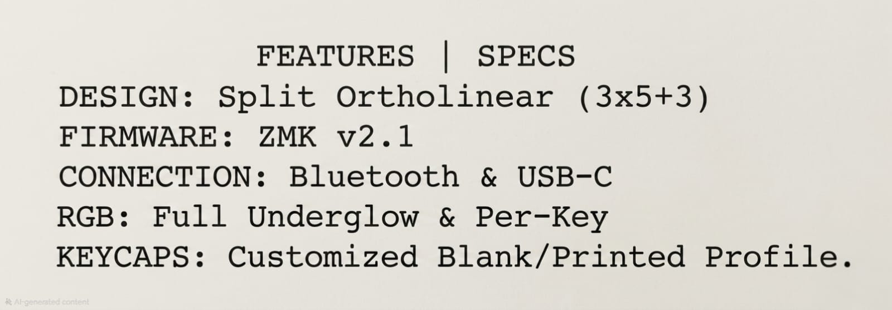
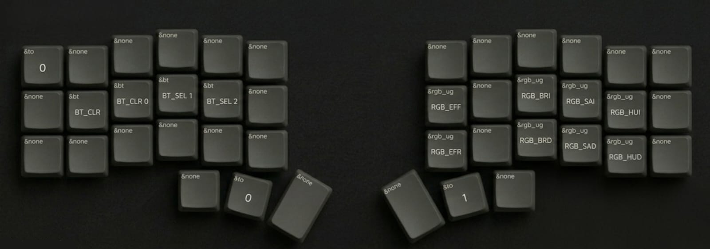

<table>
  <tr>
    <td align="center" colspan="2">
      <b>SPECS</b>  
      <!-- You can add width="50%" inside the img tag below if it renders too large -->
      
    </td>
  </tr>
  
  <!-- Row 1: 1 | 2 -->
  <tr>
    <td align="center" width="50%">
      <b>QWERT</b> <code>QWE</code>  
      
    </td>
    <td align="center" width="50%">
      <b>COLEMAK</b> <code>COL</code>  
      
    </td>
  </tr>
  
  <!-- Row 2: 3 | 4 -->
  <tr>
    <td align="center">
      <b>NUMBER</b> <code>NUM</code>  
      
    </td>
    <td align="center">
      <b>SYMBOL</b> <code>SYM</code>  
      
    </td>
  </tr>
  
  <!-- Row 3: Centered 5 -->
  <tr>
    <td align="center" colspan="2">
      <b>CONFIG</b> <code>CON</code>  
      <!-- You can add width="50%" inside the img tag below if it renders too large -->
      
    </td>
  </tr>
</table>
